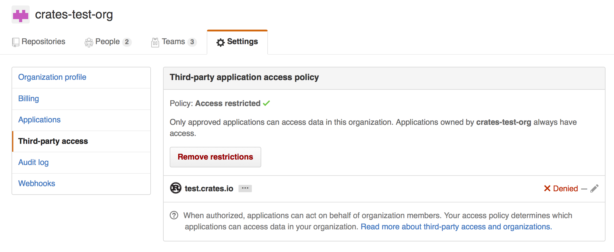
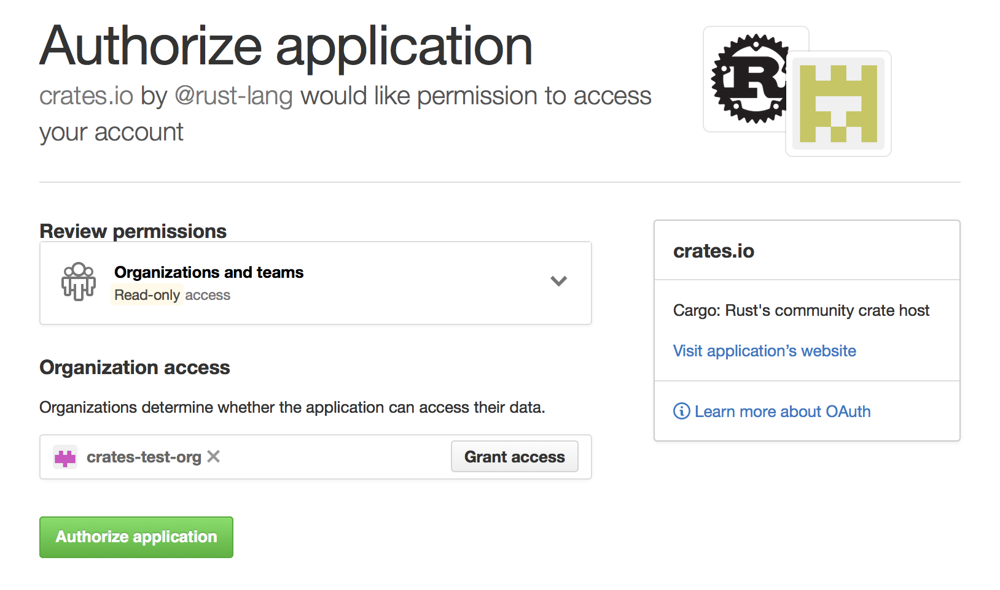

% Cargo and crates.io

In addition to using dependencies from git repositories (as mentioned in
[the guide](guide.html)) Cargo can also publish to and download from the
[crates.io][crates-io] central repository. This site serves as a location to
discover and download packages, and `cargo` is configured to use it by default
to find requested packages.

The guide will explain how crates can use crates.io through the `cargo` command
line tool.

[crates-io]: https://crates.io/

# Using crates.io-based crates

The method of specifying a dependency on a crate from crates.io is slightly
different than the method of specifying a dependency on a git repository. The
syntax for doing so is:

```toml
[dependencies]
glob = "0.0.3"
```

With this format, adding new dependencies should just add a new line, you don’t
need to add `[dependencies]` for each dependency listed, for example:

```toml
[dependencies]
glob = "0.0.3"
num = "0.0.4"
```

The string value for each key in this table is a [semver][semver] version
requirement.

[semver]: https://github.com/steveklabnik/semver#requirements

**Caret requirements** allow SemVer compatible updates to a specified version.

`^1.2.3` is an example of a caret requirement.

When considering “compatible” versions, `0.1` and `0.2` are not considered
compatible, but `1.0` and `1.1` are for example. If no operator is specified,
this is the default requirement (e.g. `1.3` is the same as `^1.3`).

`0.0.x` is not considered compatible with any other version. Missing minor and
patch versions are desugared to `0` but allow flexibility for that value.

```notrust
^1.2.3 := >=1.2.3 <2.0.0
^0.2.3 := >=0.2.3 <0.3.0
^0.0.3 := >=0.0.3 <0.0.4
^0.0 := >=0.0.0 <0.1.0
^0 := >=0.0.0 <1.0.0
```

**Tilde requirements** specify a minimal version with some ability to update.

`~1.2.3` is an example of a tilde requirement.

```notrust
~1.2.3 := >=1.2.3 <1.3.0
~1.2 := >=1.2.0 <1.3.0
~1 := >=1.0.0 <2.0.0
```

**Wildcard requirements** allow for any version where the wildcard is positioned.

`*`, `1.*` and `1.2.*` are examples of wildcard requirements.

```notrust
* := >=0.0.0
1.* := >=1.0.0 <2.0.0
1.2.* := >=1.2.0 <1.3.0
```

**Inequality requirements** allow manually specifying a version range or an
exact version to depend on.

Here are some examples of inequality requirements:

```notrust
>= 1.2.0
> 1
< 2
= 1.2.3
```

Multiple version requirements can also be separated with a comma, e.g. `>= 1.2,
< 1.5`.

# Pre-1.0 versions

While SemVer says that there is no compatibility before 1.0.0, many programmers
treat a `0.x.y` release in the same way as a `1.x.y` release: that is, `y` is
incremented for bugfixes, and `x` is incremented for new features.

As such, Cargo considers a `0.x.y` and `0.x.z` version, where `z > y`, to be
compatible.

# Publishing crates

Ok, now that we’ve got a crate which is using dependencies from crates.io,
let’s publish it! Publishing a crate is when a specific version is uploaded to
crates.io.

Take care when publishing a crate, because a publish is **permanent**. The
version can never be overwritten, and the code cannot be deleted. There is no
limit to the number of versions which can be published, however.

## Acquiring an API token

First thing’s first, you’ll need an account on [crates.io][crates-io] to acquire
an API token. To do so, [visit the home page][crates-io] and log in via a GitHub
account (required for now). After this, visit your [Account
Settings](https://crates.io/me) page and run the `cargo login` command
specified.

```notrust
$ cargo login abcdefghijklmnopqrstuvwxyz012345
```

This command will inform Cargo of your API token and store it locally in your
`~/.cargo/config`. Note that this token is a **secret** and should not be shared
with anyone else. If it leaks for any reason, you should regenerate it
immediately.

## Packaging a crate

The next step is to package up your crate into a format that can be uploaded to
crates.io. For this we’ll use the `cargo package` subcommand. This will take
our entire crate and package it all up into a `*.crate` file in the
`target/package` directory.

```notrust
$ cargo package
```

As an added bonus, the `*.crate` will be verified independently of the current
source tree. After the `*.crate` is created, it’s unpacked into
`target/package` and then built from scratch to ensure that all necessary files
are there for the build to succeed. This behavior can be disabled with the
`--no-verify` flag.

Now’s a good time to take a look at the `*.crate` file to make sure you didn’t
accidentally package up that 2GB video asset. Cargo will automatically ignore
files ignored by your version control system when packaging, but if you want to
specify an extra set of files to ignore you can use the `exclude` key in the
manifest:

```toml
[package]
# ...
exclude = [
    "public/assets/*",
    "videos/*",
]
```

The syntax of each element in this array is what
[rust-lang/glob](https://github.com/rust-lang/glob) accepts. If you’d rather
roll with a whitelist instead of a blacklist, Cargo also supports an `include`
key:

```toml
[package]
# ...
include = [
    "**/*.rs",
    "Cargo.toml",
]
```

## Uploading the crate

Now that we’ve got a `*.crate` file ready to go, it can be uploaded to
crates.io with the `cargo publish` command. And that’s it, you’ve now published
your first crate!

```notrust
$ cargo publish
```

If you’d like to skip the `cargo package` step, the `cargo publish` subcommand
will automatically package up the local crate if a copy isn’t found already.

Be sure to check out the [metadata you can
specify](manifest.html#package-metadata) to ensure your crate can be discovered
more easily!

## Restrictions

There are a few restrictions when publishing a crate in the registry:

* Once a version is uploaded, it can never be overwritten. To upload a new copy
  of a crate you must upload a new version.
* Crate names are allocated on a first-come-first-serve basis. Once a crate name
  is taken it cannot be used for another crate.
* There is currently a 10MB upload size limit on `*.crate` files.

# Managing a crates.io-based crate

Management of crates is primarily done through the command line `cargo` tool
rather than the crates.io web interface. For this, there are a few subcommands
to manage a crate.

## `cargo yank`

Occasions may arise where you publish a version of a crate that actually ends up
being broken for one reason or another (syntax error, forgot to include a file,
etc.). For situations such as this, Cargo supports a “yank” of a version of a
crate.

```notrust
$ cargo yank --vers 1.0.1
$ cargo yank --vers 1.0.1 --undo
```

A yank **does not** delete any code. This feature is not intended for deleting
accidentally uploaded secrets, for example. If that happens, you must reset
those secrets immediately.

The semantics of a yanked version are that no new dependencies can be created
against that version, but all existing dependencies continue to work. One of the
major goals of crates.io is to act as a permanent archive of crates that does
not change over time, and allowing deletion of a version would go against this
goal. Essentially a yank means that all projects with a `Cargo.lock` will not
break, while any future `Cargo.lock` files generated will not list the yanked
version.

## `cargo owner`

A crate is often developed by more than one person, or the primary maintainer
may change over time! The owner of a crate is the only person allowed to publish
new versions of the crate, but an owner may designate additional owners.

```notrust
$ cargo owner --add my-buddy
$ cargo owner --remove my-buddy
$ cargo owner --add github:rust-lang:owners
$ cargo owner --remove github:rust-lang:owners
```

The owner IDs given to these commands must be GitHub user names or Github teams.

If a user name is given to `--add`, that user becomes a “named” owner, with
full rights to the crate. In addition to being able to publish or yank versions
of the crate, they have the ability to add or remove owners, *including* the
owner that made *them* an owner. Needless to say, you shouldn’t make people you
don’t fully trust into a named owner. In order to become a named owner, a user
must have logged into crates.io previously.

If a team name is given to `--add`, that team becomes a “team” owner, with
restricted right to the crate. While they have permission to publish or yank
versions of the crate, they *do not* have the ability to add or remove owners.
In addition to being more convenient for managing groups of owners, teams are
just a bit more secure against owners becoming malicious.

The syntax for teams is currently `github:org:team` (see examples above).
In order to add a team as an owner one must be a member of that team. No
such restriction applies to removing a team as an owner.

## Github Permissions

Team membership is not something Github provides simple public access to, and it
is likely for you to encounter the following message when working with them:

> It looks like you don’t have permission to query a necessary property from
Github to complete this request. You may need to re-authenticate on crates.io
to grant permission to read github org memberships. Just go to
https://crates.io/login

This is basically a catch-all for “you tried to query a team, and one of the
five levels of membership access control denied this”. That is not an
exaggeration. Github’s support for team access control is Enterprise Grade.

The most likely cause of this is simply that you last logged in before this
feature was added. We originally requested *no* permissions from Github when
authenticating users, because we didn’t actually ever use the user’s token for
anything other than logging them in. However to query team membership on your
behalf, we now require
[the `read:org` scope](https://developer.github.com/v3/oauth/#scopes).

You are free to deny us this scope, and everything that worked before teams
were introduced will keep working. However you will never be able to add a team
as an owner, or publish a crate as a team owner. If you ever attempt to do this,
you will get the error above. You may also see this error if you ever try to
publish a crate that you don’t own at all, but otherwise happens to have a team.

If you ever change your mind, or just aren’t sure if crates.io has sufficient
permission, you can always go to https://crates.io/login, which will prompt you
for permission if crates.io doesn’t have all the scopes it would like to.

An additional barrier to querying github is that the organization may be
actively denying third party access. To check this, you can go to:

    https://github.com/organizations/:org/settings/oauth_application_policy

where `:org` is the name of the organization (e.g. rust-lang). You may see
something like:



Where you may choose to explicitly remove crates.io from your organization’s
blacklist, or simply press the “Remove Restrictions” button to allow all third
party applications to access this data.

Alternatively, when crates.io requested the `read:org` scope, you could have
explicitly whitelisted crates.io querying the org in question by pressing
the “Grant Access” button next to its name:


