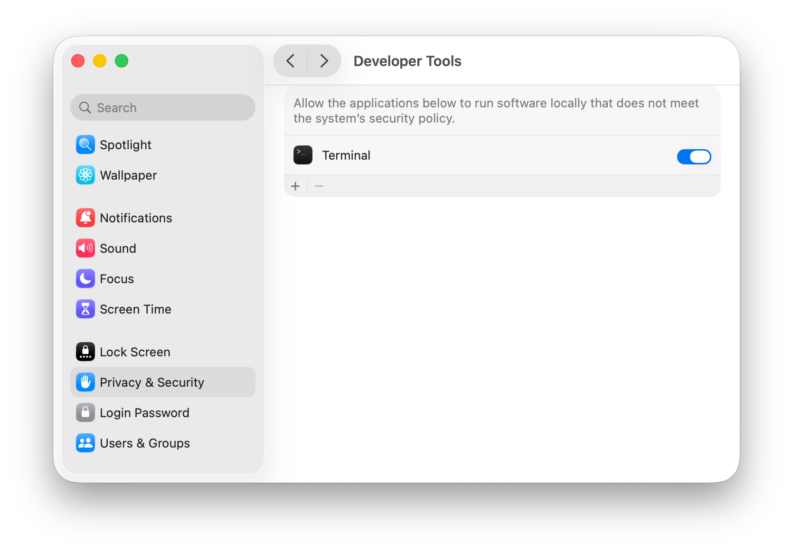

# Antivirus Software

Many operating systems include antivirus software programs that scan the system for malware. These sometimes interfere with development workflows, see below.

## XProtect

macOS has a layered system for protecting against malware, see [Apple's documentation](https://support.apple.com/en-gb/guide/security/sec469d47bd8/web) for details. One of the components here is XProtect, which intercepts all binary launches and scans new binaries for malware before executing them.

Unfortunately, scanning binaries is done on a single thread and can be fairly slow (100-300ms). This affects projects developed with Cargo, since Cargo creates many binaries that are often only executed once (examples include build scripts and test binaries).

You can avoid this overhead by doing the following:
- Open `System Settings` and navigate to the `Privacy & Security` item.
- On older macOS versions, click the `Privacy` tab.
- Navicate to the `Developer Tools` item.
- Add your terminal to the list, and enable it.
  - You can run `spctl developer-mode enable-terminal` to add `Terminal.app` to this list.
  - If you use a third-party terminal application, you might need to add that here as well.
- Restart your terminal.

See the screenshot below for what this looks like on macOS 26 Tahoe.

### Security considerations

Unfortunately, there doesn't seem to be a way to scope this to select binaries, e.g. adding Cargo directly as a developer tool has no effect, it has to be the "top-level" process.

As such, **this disables your antivirus for all software that is launched via your terminal**. This is only one part of macOS' security protections that specifically checks for known malware signatures, and it is nowhere near as unsafe as disabling SIP or giving Full Disk Access would be - but depending on your security constraints, you might still consider leaving it enabled.

Changing this setting has not been tested on systems in enterprise environments, it might affect more things there.
