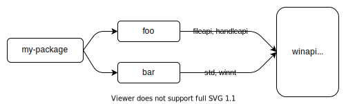

# Features

Cargo "features" provide a mechanism to express [conditional compilation] and
[optional dependencies](#optional-dependencies). A package defines a set of
named features in the `[features]` table of `Cargo.toml`, and each feature can
either be enabled or disabled. Features for the package being built can be
enabled on the command-line with flags such as `--features`. Features for
dependencies can be enabled in the dependency declaration in `Cargo.toml`.

See also the [Features Examples] chapter for some examples of how features can
be used.

[conditional compilation]: ../../reference/conditional-compilation.md
[Features Examples]: features-examples.md

## The `[features]` section

Features are defined in the `[features]` table in `Cargo.toml`. Each feature
specifies an array of other features or optional dependencies that it enables.
The following examples illustrate how features could be used for a 2D image
processing library where support for different image formats can be optionally
included:

```toml
[features]
# Defines a feature named `webp` that does not enable any other features.
webp = []
```

With this feature defined, [`cfg` expressions] can be used to conditionally
include code to support the requested feature at compile time. For example,
inside `lib.rs` of the package could include this:

```rust
// This conditionally includes a module which implements WEBP support.
#[cfg(feature = "webp")]
pub mod webp;
```

Cargo sets features in the package using the `rustc` [`--cfg` flag], and code
can test for their presence with the [`cfg` attribute] or the [`cfg` macro].

Features can list other features to enable. For example, the ICO image format
can contain BMP and PNG images, so when it is enabled, it should make sure
those other features are enabled, too:

```toml
[features]
bmp = []
png = []
ico = ["bmp", "png"]
webp = []
```

Feature names may include characters from the [Unicode XID standard] (which
includes most letters), and additionally allows starting with `_` or digits
`0` through `9`, and after the first character may also contain `-`, `+`, or
`.`.

> **Note**: [crates.io] imposes additional constraints on feature name syntax
> that they must only be [ASCII alphanumeric] characters or `_`, `-`, or `+`.

[crates.io]: https://crates.io/
[Unicode XID standard]: https://unicode.org/reports/tr31/
[ASCII alphanumeric]: ../../std/primitive.char.html#method.is_ascii_alphanumeric
[`--cfg` flag]: ../../rustc/command-line-arguments.md#option-cfg
[`cfg` expressions]: ../../reference/conditional-compilation.md
[`cfg` attribute]: ../../reference/conditional-compilation.md#the-cfg-attribute
[`cfg` macro]: ../../std/macro.cfg.html

## The `default` feature

By default, all features are disabled unless explicitly enabled. This can be
changed by specifying the `default` feature:

```toml
[features]
default = ["ico", "webp"]
bmp = []
png = []
ico = ["bmp", "png"]
webp = []
```

When the package is built, the `default` feature is enabled which in turn
enables the listed features. This behavior can be changed by:

* The `--no-default-features` [command-line
  flag](#command-line-feature-options) disables the default features of the
  package.
* The `default-features = false` option can be specified in a [dependency
  declaration](#dependency-features).

> **Note**: Be careful about choosing the default feature set. The default
> features are a convenience that make it easier to use a package without
> forcing the user to carefully select which features to enable for common
> use, but there are some drawbacks. Dependencies automatically enable default
> features unless `default-features = false` is specified. This can make it
> difficult to ensure that the default features are not enabled, especially
> for a dependency that appears multiple times in the dependency graph. Every
> package must ensure that `default-features = false` is specified to avoid
> enabling them.
>
> Another issue is that it can be a [SemVer incompatible
> change](#semver-compatibility) to remove a feature from the default set, so
> you should be confident that you will keep those features.

## Optional dependencies

Dependencies can be marked "optional", which means they will not be compiled
by default. For example, let's say that our 2D image processing library uses
an external package to handle GIF images. This can be expressed like this:

```toml
[dependencies]
gif = { version = "0.11.1", optional = true }
```

By default, this optional dependency implicitly defines a feature that looks
like this:

```toml
[features]
gif = ["dep:gif"]
```

This means that this dependency will only be included if the `gif`
feature is enabled.
The same `cfg(feature = "gif")` syntax can be used in the code, and the
dependency can be enabled just like any feature such as `--features gif` (see
[Command-line feature options](#command-line-feature-options) below).

In some cases, you may not want to expose a feature that has the same name
as the optional dependency.
For example, perhaps the optional dependency is an internal detail, or you
want to group multiple optional dependencies together, or you just want to use
a better name.
If you specify the optional dependency with the `dep:` prefix anywhere
in the `[features]` table, that disables the implicit feature.

> **Note**: The `dep:` syntax is only available starting with Rust 1.60.
> Previous versions can only use the implicit feature name.

For example, let's say in order to support the AVIF image format, our library
needs two other dependencies to be enabled:

```toml
[dependencies]
ravif = { version = "0.6.3", optional = true }
rgb = { version = "0.8.25", optional = true }

[features]
avif = ["dep:ravif", "dep:rgb"]
```

In this example, the `avif` feature will enable the two listed dependencies.
This also avoids creating the implicit `ravif` and `rgb` features, since we
don't want users to enable those individually as they are internal details to
our crate.

> **Note**: Another way to optionally include a dependency is to use
> [platform-specific dependencies]. Instead of using features, these are
> conditional based on the target platform.

[platform-specific dependencies]: specifying-dependencies.md#platform-specific-dependencies

## Dependency features

Features of dependencies can be enabled within the dependency declaration. The
`features` key indicates which features to enable:

```toml
[dependencies]
# Enables the `derive` feature of serde.
serde = { version = "1.0.118", features = ["derive"] }
```

The [`default` features](#the-default-feature) can be disabled using
`default-features = false`:

```toml
[dependencies]
flate2 = { version = "1.0.3", default-features = false, features = ["zlib"] }
```

> **Note**: This may not ensure the default features are disabled. If another
> dependency includes `flate2` without specifying `default-features = false`,
> then the default features will be enabled. See [feature
> unification](#feature-unification) below for more details.

Features of dependencies can also be enabled in the `[features]` table. The
syntax is `"package-name/feature-name"`. For example:

```toml
[dependencies]
jpeg-decoder = { version = "0.1.20", default-features = false }

[features]
# Enables parallel processing support by enabling the "rayon" feature of jpeg-decoder.
parallel = ["jpeg-decoder/rayon"]
```

The `"package-name/feature-name"` syntax will also enable `package-name`
if it is an optional dependency. Often this is not what you want.
You can add a `?` as in `"package-name?/feature-name"` which will only enable
the given feature if something else enables the optional dependency.

> **Note**: The `?` syntax is only available starting with Rust 1.60.

For example, let's say we have added some serialization support to our
library, and it requires enabling a corresponding feature in some optional
dependencies.
That can be done like this:

```toml
[dependencies]
serde = { version = "1.0.133", optional = true }
rgb = { version = "0.8.25", optional = true }

[features]
serde = ["dep:serde", "rgb?/serde"]
```

In this example, enabling the `serde` feature will enable the serde
dependency.
It will also enable the `serde` feature for the `rgb` dependency, but only if
something else has enabled the `rgb` dependency.

## Command-line feature options

The following command-line flags can be used to control which features are
enabled:

* `--features` _FEATURES_: Enables the listed features. Multiple features may
  be separated with commas or spaces. If using spaces, be sure to use quotes
  around all the features if running Cargo from a shell (such as `--features
  "foo bar"`). If building multiple packages in a [workspace], the
  `package-name/feature-name` syntax can be used to specify features for
  specific workspace members.

* `--all-features`: Activates all features of all packages selected on the
  command-line.

* `--no-default-features`: Does not activate the [`default`
  feature](#the-default-feature) of the selected packages.

[workspace]: workspaces.md

## Feature unification

Features are unique to the package that defines them. Enabling a feature on a
package does not enable a feature of the same name on other packages.

When a dependency is used by multiple packages, Cargo will use the union of
all features enabled on that dependency when building it. This helps ensure
that only a single copy of the dependency is used. See the [features section]
of the resolver documentation for more details.

For example, let's look at the [`winapi`] package which uses a [large
number][winapi-features] of features. If your package depends on a package
`foo` which enables the "fileapi" and "handleapi" features of `winapi`, and
another dependency `bar` which enables the "std" and "winnt" features of
`winapi`, then `winapi` will be built with all four of those features enabled.



[`winapi`]: https://crates.io/crates/winapi
[winapi-features]: https://github.com/retep998/winapi-rs/blob/0.3.9/Cargo.toml#L25-L431

A consequence of this is that features should be *additive*. That is, enabling
a feature should not disable functionality, and it should usually be safe to
enable any combination of features. A feature should not introduce a
[SemVer-incompatible change](#semver-compatibility).

For example, if you want to optionally support [`no_std`] environments, **do
not** use a `no_std` feature. Instead, use a `std` feature that *enables*
`std`. For example:

```rust
#![no_std]

#[cfg(feature = "std")]
extern crate std;

#[cfg(feature = "std")]
pub fn function_that_requires_std() {
    // ...
}
```

[`no_std`]: ../../reference/names/preludes.html#the-no_std-attribute
[features section]: resolver.md#features

### Mutually exclusive features

There are rare cases where features may be mutually incompatible with one
another. This should be avoided if at all possible, because it requires
coordinating all uses of the package in the dependency graph to cooperate to
avoid enabling them together. If it is not possible, consider adding a compile
error to detect this scenario. For example:

```rust,ignore
#[cfg(all(feature = "foo", feature = "bar"))]
compile_error!("feature \"foo\" and feature \"bar\" cannot be enabled at the same time");
```

Instead of using mutually exclusive features, consider some other options:

* Split the functionality into separate packages.
* When there is a conflict, [choose one feature over
  another][feature-precedence]. The [`cfg-if`] package can help with writing
  more complex `cfg` expressions.
* Architect the code to allow the features to be enabled concurrently, and use
  runtime options to control which is used. For example, use a config file,
  command-line argument, or environment variable to choose which behavior to
  enable.

[`cfg-if`]: https://crates.io/crates/cfg-if
[feature-precedence]: features-examples.md#feature-precedence

### Inspecting resolved features

In complex dependency graphs, it can sometimes be difficult to understand how
different features get enabled on various packages. The [`cargo tree`] command
offers several options to help inspect and visualize which features are
enabled. Some options to try:

* `cargo tree -e features`: This will show features in the dependency graph.
  Each feature will appear showing which package enabled it.
* `cargo tree -f "{p} {f}"`: This is a more compact view that shows a
  comma-separated list of features enabled on each package.
* `cargo tree -e features -i foo`: This will invert the tree, showing how
  features flow into the given package "foo". This can be useful because
  viewing the entire graph can be quite large and overwhelming. Use this when
  you are trying to figure out which features are enabled on a specific
  package and why. See the example at the bottom of the [`cargo tree`] page on
  how to read this.

[`cargo tree`]: ../commands/cargo-tree.md

## Feature resolver version 2

A different feature resolver can be specified with the `resolver` field in
`Cargo.toml`, like this:

```toml
[package]
name = "my-package"
version = "1.0.0"
resolver = "2"
```

See the [resolver versions] section for more detail on specifying resolver
versions.

The version `"2"` resolver avoids unifying features in a few situations where
that unification can be unwanted. The exact situations are described in the
[resolver chapter][resolver-v2], but in short, it avoids unifying in these
situations:

* Features enabled on [platform-specific dependencies] for targets not
  currently being built are ignored.
* [Build-dependencies] and proc-macros do not share features with normal
  dependencies.
* [Dev-dependencies] do not activate features unless building a target that
  needs them (like tests or examples).

Avoiding the unification is necessary for some situations. For example, if a
build-dependency enables a `std` feature, and the same dependency is used as a
normal dependency for a `no_std` environment, enabling `std` would break the
build.

However, one drawback is that this can increase build times because the
dependency is built multiple times (each with different features). When using
the version `"2"` resolver, it is recommended to check for dependencies that
are built multiple times to reduce overall build time. If it is not *required*
to build those duplicated packages with separate features, consider adding
features to the `features` list in the [dependency
declaration](#dependency-features) so that the duplicates end up with the same
features (and thus Cargo will build it only once). You can detect these
duplicate dependencies with the [`cargo tree --duplicates`][`cargo tree`]
command. It will show which packages are built multiple times; look for any
entries listed with the same version. See [Inspecting resolved
features](#inspecting-resolved-features) for more on fetching information on
the resolved features. For build dependencies, this is not necessary if you
are cross-compiling with the `--target` flag because build dependencies are
always built separately from normal dependencies in that scenario.

### Resolver version 2 command-line flags

The `resolver = "2"` setting also changes the behavior of the `--features` and
`--no-default-features` [command-line options](#command-line-feature-options).

With version `"1"`, you can only enable features for the package in the
current working directory. For example, in a workspace with packages `foo` and
`bar`, and you are in the directory for package `foo`, and ran the command
`cargo build -p bar --features bar-feat`, this would fail because the
`--features` flag only allowed enabling features on `foo`.

With `resolver = "2"`, the features flags allow enabling features for any of
the packages selected on the command-line with `-p` and `--workspace` flags.
For example:

```sh
# This command is allowed with resolver = "2", regardless of which directory
# you are in.
cargo build -p foo -p bar --features foo-feat,bar-feat

# This explicit equivalent works with any resolver version:
cargo build -p foo -p bar --features foo/foo-feat,bar/bar-feat
```

Additionally, with `resolver = "1"`, the `--no-default-features` flag only
disables the default feature for the package in the current directory. With
version "2", it will disable the default features for all workspace members.

[resolver versions]: resolver.md#resolver-versions
[build-dependencies]: specifying-dependencies.md#build-dependencies
[dev-dependencies]: specifying-dependencies.md#development-dependencies
[resolver-v2]: resolver.md#feature-resolver-version-2

## Build scripts

[Build scripts] can detect which features are enabled on the package by
inspecting the `CARGO_FEATURE_<name>` environment variable, where `<name>` is
the feature name converted to uppercase and `-` converted to `_`.

[build scripts]: build-scripts.md

## Required features

The [`required-features` field] can be used to disable specific [Cargo
targets] if a feature is not enabled. See the linked documentation for more
details.

[`required-features` field]: cargo-targets.md#the-required-features-field
[Cargo targets]: cargo-targets.md

## SemVer compatibility

Enabling a feature should not introduce a SemVer-incompatible change. For
example, the feature shouldn't change an existing API in a way that could
break existing uses. More details about what changes are compatible can be
found in the [SemVer Compatibility chapter](semver.md).

Care should be taken when adding and removing feature definitions and optional
dependencies, as these can sometimes be backwards-incompatible changes. More
details can be found in the [Cargo section](semver.md#cargo) of the SemVer
Compatibility chapter. In short, follow these rules:

* The following is usually safe to do in a minor release:
  * Add a [new feature][cargo-feature-add] or [optional dependency][cargo-dep-add].
  * [Change the features used on a dependency][cargo-change-dep-feature].
* The following should usually **not** be done in a minor release:
  * [Remove a feature][cargo-feature-remove] or [optional dependency][cargo-remove-opt-dep].
  * [Moving existing public code behind a feature][item-remove].
  * [Remove a feature from a feature list][cargo-feature-remove-another].

See the links for caveats and examples.

[cargo-change-dep-feature]: semver.md#cargo-change-dep-feature
[cargo-dep-add]: semver.md#cargo-dep-add
[cargo-feature-add]: semver.md#cargo-feature-add
[item-remove]: semver.md#item-remove
[cargo-feature-remove]: semver.md#cargo-feature-remove
[cargo-remove-opt-dep]: semver.md#cargo-remove-opt-dep
[cargo-feature-remove-another]: semver.md#cargo-feature-remove-another

## Feature documentation and discovery

You are encouraged to document which features are available in your package.
This can be done by adding [doc comments] at the top of `lib.rs`. As an
example, see the [regex crate source], which when rendered can be viewed on
[docs.rs][regex-docs-rs]. If you have other documentation, such as a user
guide, consider adding the documentation there (for example, see [serde.rs]).
If you have a binary project, consider documenting the features in the README
or other documentation for the project (for example, see [sccache]).

Clearly documenting the features can set expectations about features that are
considered "unstable" or otherwise shouldn't be used. For example, if there is
an optional dependency, but you don't want users to explicitly list that
optional dependency as a feature, exclude it from the documented list.

Documentation published on [docs.rs] can use metadata in `Cargo.toml` to
control which features are enabled when the documentation is built. See
[docs.rs metadata documentation] for more details.

> **Note**: Rustdoc has experimental support for annotating the documentation
> to indicate which features are required to use certain APIs. See the
> [`doc_cfg`] documentation for more details. An example is the [`syn`
> documentation], where you can see colored boxes which note which features
> are required to use it.

[docs.rs metadata documentation]: https://docs.rs/about/metadata
[docs.rs]: https://docs.rs/
[serde.rs]: https://serde.rs/feature-flags.html
[doc comments]: ../../rustdoc/how-to-write-documentation.html
[regex crate source]: https://github.com/rust-lang/regex/blob/1.4.2/src/lib.rs#L488-L583
[regex-docs-rs]: https://docs.rs/regex/1.4.2/regex/#crate-features
[sccache]: https://github.com/mozilla/sccache/blob/0.2.13/README.md#build-requirements
[`doc_cfg`]: ../../unstable-book/language-features/doc-cfg.html
[`syn` documentation]: https://docs.rs/syn/1.0.54/syn/#modules

### Discovering features

When features are documented in the library API, this can make it easier for
your users to discover which features are available and what they do. If the
feature documentation for a package isn't readily available, you can look at
the `Cargo.toml` file, but sometimes it can be hard to track it down. The
crate page on [crates.io] has a link to the source repository if available.
Tools like [`cargo vendor`] or [cargo-clone-crate] can be used to download the
source and inspect it.

[`cargo vendor`]: ../commands/cargo-vendor.md
[cargo-clone-crate]: https://crates.io/crates/cargo-clone-crate

## Feature combinations

Because features are a form of conditional compilation, they require an exponential number of configurations and test cases to be 100% covered. By default, tests, docs, and other tooling such as [Clippy](https://github.com/rust-lang/rust-clippy) will only run with the default set of features.

We encourage you to consider your strategy and tooling in regards to different feature combinations --- Every project will have different requirements in conjunction with time, resources, and the cost-benefit of covering specific scenarios. Common configurations may be with / without default features, specific combinations of features, or all combinations of features.
