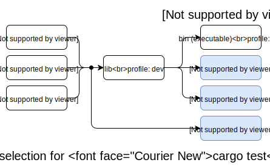

## Profiles

Profiles provide a way to alter the compiler settings, influencing things like
optimizations and debugging symbols.

Cargo has 4 built-in profiles: `dev`, `release`, `test`, and `bench`. It
automatically chooses the profile based on which command is being run, the
package and target that is being built, and command-line flags like
`--release`. The selection process is [described below](#profile-selection).

Profile settings can be changed in [`Cargo.toml`](manifest.md) with the
`[profile]` table. Within each named profile, individual settings can be changed
with key/value pairs like this:

```toml
[profile.dev]
opt-level = 1               # Use slightly better optimizations.
overflow-checks = false     # Disable integer overflow checks.
```

Cargo only looks at the profile settings in the `Cargo.toml` manifest at the
root of the workspace. Profile settings defined in dependencies will be
ignored.

Additionally, profiles can be overridden from a [config] definition.
Specifying a profile in a config file or environment variable will override
the settings from `Cargo.toml`.

[config]: config.md

### Profile settings

The following is a list of settings that can be controlled in a profile.

#### opt-level

The `opt-level` setting controls the [`-C opt-level` flag] which controls the level
of optimization. Higher optimization levels may produce faster runtime code at
the expense of longer compiler times. Higher levels may also change and
rearrange the compiled code which may make it harder to use with a debugger.

The valid options are:

* `0`: no optimizations
* `1`: basic optimizations
* `2`: some optimizations
* `3`: all optimizations
* `"s"`: optimize for binary size
* `"z"`: optimize for binary size, but also turn off loop vectorization.

It is recommended to experiment with different levels to find the right
balance for your project. There may be surprising results, such as level `3`
being slower than `2`, or the `"s"` and `"z"` levels not being necessarily
smaller. You may also want to reevaluate your settings over time as newer
versions of `rustc` changes optimization behavior.

See also [Profile Guided Optimization] for more advanced optimization
techniques.

[`-C opt-level` flag]: ../../rustc/codegen-options/index.html#opt-level
[Profile Guided Optimization]: ../../rustc/profile-guided-optimization.html

#### debug

The `debug` setting controls the [`-C debuginfo` flag] which controls the
amount of debug information included in the compiled binary.

The valid options are:

* `0` or `false`: no debug info at all
* `1`: line tables only
* `2` or `true`: full debug info

You may wish to also configure the [`split-debuginfo`](#split-debuginfo) option
depending on your needs as well.

[`-C debuginfo` flag]: ../../rustc/codegen-options/index.html#debuginfo

#### split-debuginfo

The `split-debuginfo` setting controls the [`-C split-debuginfo` flag] which
controls whether debug information, if generated, is either placed in the
executable itself or adjacent to it.

This option is a string and acceptable values are the same as those the
[compiler accepts][`-C split-debuginfo` flag]. The default value for this option
is `unpacked` on macOS for profiles that have debug information otherwise
enabled. Otherwise the default for this option is [documented with rustc][`-C
split-debuginfo` flag] and is platform-specific. Some options are only
available on the [nightly channel]. The Cargo default may change in the future
once more testing has been performed, and support for DWARF is stabilized.

[nightly channel]: ../../book/appendix-07-nightly-rust.html
[`-C split-debuginfo` flag]: ../../rustc/codegen-options/index.html#split-debuginfo

#### debug-assertions

The `debug-assertions` setting controls the [`-C debug-assertions` flag] which
turns `cfg(debug_assertions)` [conditional compilation] on or off. Debug
assertions are intended to include runtime validation which is only available
in debug/development builds. These may be things that are too expensive or
otherwise undesirable in a release build. Debug assertions enables the
[`debug_assert!` macro] in the standard library.

The valid options are:

* `true`: enabled
* `false`: disabled

[`-C debug-assertions` flag]: ../../rustc/codegen-options/index.html#debug-assertions
[conditional compilation]: ../../reference/conditional-compilation.md#debug_assertions
[`debug_assert!` macro]: ../../std/macro.debug_assert.html

#### overflow-checks

The `overflow-checks` setting controls the [`-C overflow-checks` flag] which
controls the behavior of [runtime integer overflow]. When overflow-checks are
enabled, a panic will occur on overflow.

The valid options are:

* `true`: enabled
* `false`: disabled

[`-C overflow-checks` flag]: ../../rustc/codegen-options/index.html#overflow-checks
[runtime integer overflow]: ../../reference/expressions/operator-expr.md#overflow

#### lto

The `lto` setting controls the [`-C lto` flag] which controls LLVM's [link
time optimizations]. LTO can produce better optimized code, using
whole-program analysis, at the cost of longer linking time.

The valid options are:

* `false`: Performs "thin local LTO" which performs "thin" LTO on the local
  crate only across its [codegen units](#codegen-units). No LTO is performed
  if codegen units is 1 or [opt-level](#opt-level) is 0.
* `true` or `"fat"`: Performs "fat" LTO which attempts to perform
  optimizations across all crates within the dependency graph.
* `"thin"`: Performs ["thin" LTO]. This is similar to "fat", but takes
  substantially less time to run while still achieving performance gains
  similar to "fat".
* `"off"`: Disables LTO.

See also the [`-C linker-plugin-lto`] `rustc` flag for cross-language LTO.

[`-C lto` flag]: ../../rustc/codegen-options/index.html#lto
[link time optimizations]: https://llvm.org/docs/LinkTimeOptimization.html
[`-C linker-plugin-lto`]: ../../rustc/codegen-options/index.html#linker-plugin-lto
["thin" LTO]: http://blog.llvm.org/2016/06/thinlto-scalable-and-incremental-lto.html

#### panic

The `panic` setting controls the [`-C panic` flag] which controls which panic
strategy to use.

The valid options are:

* `"unwind"`: Unwind the stack upon panic.
* `"abort"`: Terminate the process upon panic.

When set to `"unwind"`, the actual value depends on the default of the target
platform. For example, the NVPTX platform does not support unwinding, so it
always uses `"abort"`.

Tests, benchmarks, build scripts, and proc macros ignore the `panic` setting.
The `rustc` test harness currently requires `unwind` behavior. See the
[`panic-abort-tests`] unstable flag which enables `abort` behavior.

Additionally, when using the `abort` strategy and building a test, all of the
dependencies will also be forced to build with the `unwind` strategy.

[`-C panic` flag]: ../../rustc/codegen-options/index.html#panic
[`panic-abort-tests`]: unstable.md#panic-abort-tests

#### incremental

The `incremental` setting controls the [`-C incremental` flag] which controls
whether or not incremental compilation is enabled. Incremental compilation
causes `rustc` to save additional information to disk which will be reused
when recompiling the crate, improving re-compile times. The additional
information is stored in the `target` directory.

The valid options are:

* `true`: enabled
* `false`: disabled

Incremental compilation is only used for workspace members and "path"
dependencies.

The incremental value can be overridden globally with the `CARGO_INCREMENTAL`
[environment variable] or the [`build.incremental`] config variable.

[`-C incremental` flag]: ../../rustc/codegen-options/index.html#incremental
[environment variable]: environment-variables.md
[`build.incremental`]: config.md#buildincremental

#### codegen-units

The `codegen-units` setting controls the [`-C codegen-units` flag] which
controls how many "code generation units" a crate will be split into. More
code generation units allows more of a crate to be processed in parallel
possibly reducing compile time, but may produce slower code.

This option takes an integer greater than 0.

The default is 256 for [incremental](#incremental) builds, and 16 for
non-incremental builds.

[`-C codegen-units` flag]: ../../rustc/codegen-options/index.html#codegen-units

#### rpath

The `rpath` setting controls the [`-C rpath` flag] which controls
whether or not [`rpath`] is enabled.

[`-C rpath` flag]: ../../rustc/codegen-options/index.html#rpath
[`rpath`]: https://en.wikipedia.org/wiki/Rpath

#### trim-path

The `trim-path` setting controls the [`--remap-path-prefix` flag] to trim everything
before the package root from debuginfo and macros.

This option can either be a boolean or a string.

* When this option is false, no paths are remapped.
* When this option is true, the package root is trimmed from paths.
* When this option is a string, the package root is trimmed from paths and the
specifed string is preappended instead.

This option is only available on the [nightly channel].

[nightly channel]: ../../book/appendix-07-nightly-rust.html
[`--remap-path-prefix` flag]:  ../../rustc/command-line-arguments.html#--remap-path-prefix-remap-source-names-in-output


### Default profiles

#### dev

The `dev` profile is used for normal development and debugging. It is the
default for build commands like [`cargo build`].

The default settings for the `dev` profile are:

```toml
[profile.dev]
opt-level = 0
debug = true
split-debuginfo = '...'  # Platform-specific.
debug-assertions = true
overflow-checks = true
lto = false
panic = 'unwind'
incremental = true
codegen-units = 256
rpath = false
trim-path = false
```

#### release

The `release` profile is intended for optimized artifacts used for releases
and in production. This profile is used when the `--release` flag is used, and
is the default for [`cargo install`].

The default settings for the `release` profile are:

```toml
[profile.release]
opt-level = 3
debug = false
split-debuginfo = '...'  # Platform-specific.
debug-assertions = false
overflow-checks = false
lto = false
panic = 'unwind'
incremental = false
codegen-units = 16
rpath = false
trim-path = false
```

#### test

The `test` profile is used for building tests, or when benchmarks are built in
debug mode with `cargo build`.

The default settings for the `test` profile are:

```toml
[profile.test]
opt-level = 0
debug = 2
split-debuginfo = '...'  # Platform-specific.
debug-assertions = true
overflow-checks = true
lto = false
panic = 'unwind'    # This setting is always ignored.
incremental = true
codegen-units = 256
rpath = false
trim-path = false
```

#### bench

The `bench` profile is used for building benchmarks, or when tests are built
with the `--release` flag.

The default settings for the `bench` profile are:

```toml
[profile.bench]
opt-level = 3
debug = false
split-debuginfo = '...'  # Platform-specific.
debug-assertions = false
overflow-checks = false
lto = false
panic = 'unwind'    # This setting is always ignored.
incremental = false
codegen-units = 16
rpath = false
trim-path = false
```

#### Build Dependencies

All profiles, by default, do not optimize build dependencies (build scripts,
proc macros, and their dependencies). The default settings for build overrides
are:

```toml
[profile.dev.build-override]
opt-level = 0
codegen-units = 256

[profile.release.build-override]
opt-level = 0
codegen-units = 256
```

Build dependencies otherwise inherit settings from the active profile in use, as
described below.

### Profile selection

The profile used depends on the command, the package, the Cargo target, and
command-line flags like `--release`.

Build commands like [`cargo build`], [`cargo rustc`], [`cargo check`], and
[`cargo run`] default to using the `dev` profile. The `--release` flag may be
used to switch to the `release` profile.

The [`cargo install`] command defaults to the `release` profile, and may use
the `--debug` flag to switch to the `dev` profile.

Test targets are built with the `test` profile by default. The `--release`
flag switches tests to the `bench` profile.

Bench targets are built with the `bench` profile by default. The [`cargo
build`] command can be used to build a bench target with the `test` profile to
enable debugging.

Note that when using the [`cargo test`] and [`cargo bench`] commands, the
`test`/`bench` profiles only apply to the final test executable. Dependencies
will continue to use the `dev`/`release` profiles. Also note that when a
library is built for unit tests, then the library is built with the `test`
profile. However, when building an integration test target, the library target
is built with the `dev` profile and linked into the integration test
executable.




[`cargo bench`]: ../commands/cargo-bench.md
[`cargo build`]: ../commands/cargo-build.md
[`cargo check`]: ../commands/cargo-check.md
[`cargo install`]: ../commands/cargo-install.md
[`cargo run`]: ../commands/cargo-run.md
[`cargo rustc`]: ../commands/cargo-rustc.md
[`cargo test`]: ../commands/cargo-test.md

### Overrides

Profile settings can be overridden for specific packages and build-time
crates. To override the settings for a specific package, use the `package`
table to change the settings for the named package:

```toml
# The `foo` package will use the -Copt-level=3 flag.
[profile.dev.package.foo]
opt-level = 3
```

The package name is actually a [Package ID Spec](pkgid-spec.md), so you can
target individual versions of a package with syntax such as
`[profile.dev.package."foo:2.1.0"]`.

To override the settings for all dependencies (but not any workspace member),
use the `"*"` package name:

```toml
# Set the default for dependencies.
[profile.dev.package."*"]
opt-level = 2
```

To override the settings for build scripts, proc macros, and their
dependencies, use the `build-override` table:

```toml
# Set the settings for build scripts and proc-macros.
[profile.dev.build-override]
opt-level = 3
```

> Note: When a dependency is both a normal dependency and a build dependency,
> Cargo will try to only build it once when `--target` is not specified. When
> using `build-override`, the dependency may need to be built twice, once as a
> normal dependency and once with the overridden build settings. This may
> increase initial build times.

The precedence for which value is used is done in the following order (first
match wins):

1. `[profile.dev.package.name]` — A named package.
2. `[profile.dev.package."*"]` — For any non-workspace member.
3. `[profile.dev.build-override]` — Only for build scripts, proc macros, and
   their dependencies.
4. `[profile.dev]` — Settings in `Cargo.toml`.
5. Default values built-in to Cargo.

Overrides cannot specify the `panic`, `lto`, or `rpath` settings.

#### Overrides and generics

The location where generic code is instantiated will influence the
optimization settings used for that generic code. This can cause subtle
interactions when using profile overrides to change the optimization level of
a specific crate. If you attempt to raise the optimization level of a
dependency which defines generic functions, those generic functions may not be
optimized when used in your local crate. This is because the code may be
generated in the crate where it is instantiated, and thus may use the
optimization settings of that crate.

For example, [nalgebra] is a library which defines vectors and matrices making
heavy use of generic parameters. If your local code defines concrete nalgebra
types like `Vector4<f64>` and uses their methods, the corresponding nalgebra
code will be instantiated and built within your crate. Thus, if you attempt to
increase the optimization level of `nalgebra` using a profile override, it may
not result in faster performance.

Further complicating the issue, `rustc` has some optimizations where it will
attempt to share monomorphized generics between crates. If the opt-level is 2
or 3, then a crate will not use monomorphized generics from other crates, nor
will it export locally defined monomorphized items to be shared with other
crates. When experimenting with optimizing dependencies for development,
consider trying opt-level 1, which will apply some optimizations while still
allowing monomorphized items to be shared.

[nalgebra]: https://crates.io/crates/nalgebra
