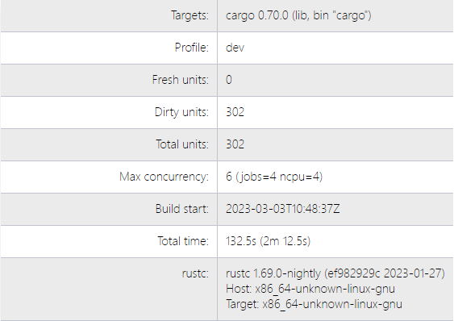
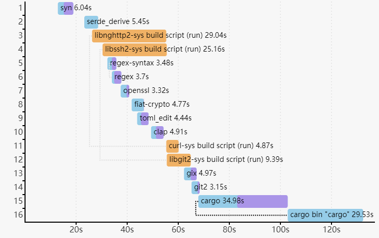
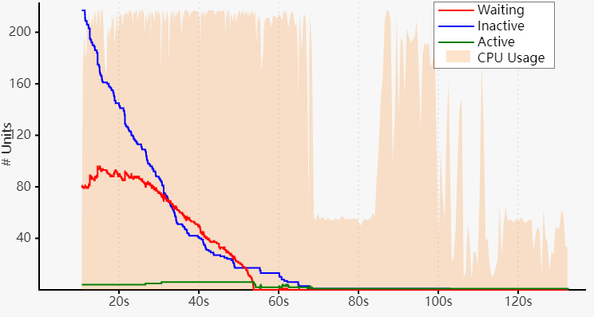

# Reporting build timings
The `--timings` option gives some information about how long each compilation
takes, and tracks concurrency information over time.

```sh
cargo build --timings
```

This writes an HTML report in `target/cargo-timings/cargo-timing.html`. This
also writes a copy of the report to the same directory with a timestamp in the
filename, if you want to look at older runs.

## Reading the graphs

There are two tables and two graphs in the output. 

The first table displays the build information of the project, including the 
number of units built, the maximum number of concurrency, build time, and the 
version information of the currently used compiler.



The "unit" graph shows the duration of each unit over time. A "unit" is a single
compiler invocation. There are lines that show which additional units are 
"unlocked" when a unit finishes. That is, it shows the new units that are now 
allowed to run because their dependencies are all finished. Hover the mouse over
a unit to highlight the lines. This can help visualize the critical path of 
dependencies. This may change between runs because the units may finish in 
different orders.

The "codegen" times are highlighted in a lavender color. In some cases, build
pipelining allows units to start when their dependencies are performing code
generation. This information is not always displayed (for example, binary
units do not show when code generation starts).

The "custom build" units are `build.rs` scripts, which when run are
highlighted in orange.



The second graph shows Cargo's concurrency over time. The background
indicates CPU usage. The three lines are:
- "Waiting" (red) --- This is the number of units waiting for a CPU slot to
  open.
- "Inactive" (blue) --- This is the number of units that are waiting for their
  dependencies to finish.
- "Active" (green) --- This is the number of units currently running.



Note: This does not show the concurrency in the compiler itself. `rustc`
coordinates with Cargo via the "job server" to stay within the concurrency
limit. This currently mostly applies to the code generation phase.

Tips for addressing compile times:
- Look for slow dependencies.
    - Check if they have features that you may wish to consider disabling.
    - Consider trying to remove the dependency completely.
- Look for a crate being built multiple times with different versions. Try to
  remove the older versions from the dependency graph.
- Split large crates into smaller pieces.
- If there are a large number of crates bottlenecked on a single crate, focus
  your attention on improving that one crate to improve parallelism.

The last table lists the total time and "codegen" time spent on each unit,
as well as the features that were enabled during each unit's compilation.
